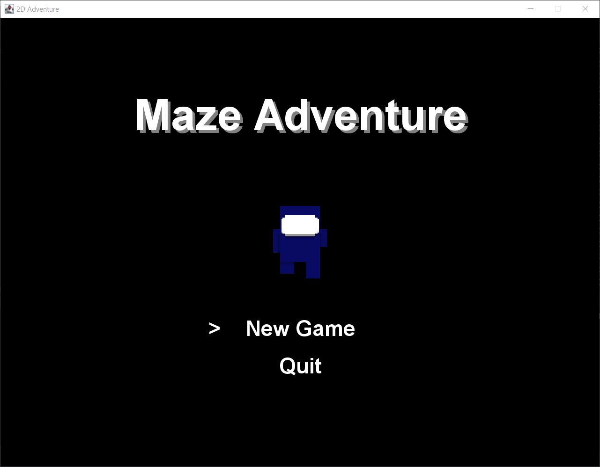
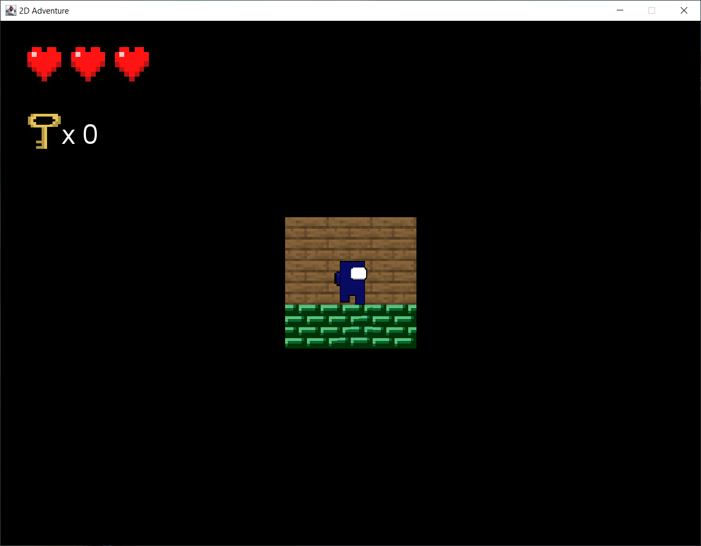

# LabEscape
LabEscape - A 2D Maze Escape Game

LabEscape Logo

Welcome to LabEscape, a thrilling 2D maze escape game developed in Java. In this game, you'll navigate through a challenging maze, searching for keys to unlock doors, collecting speed boost items, and facing off against menacing monsters.

Table of Contents

## Game Features

LabEscape offers a variety of exciting features that will keep you engaged and entertained:

- Maze Exploration
- Key and Door System
- Speed Boosts
- Monster Encounters
- Health System

[Learn more about the game features](#game-features)

## How to Play

To play LabEscape, follow these steps:

1. **Installation**: See the [Installation](#installation) section for instructions on how to set up the game.

2. **Controls**: Familiarize yourself with the [Controls](#controls) to navigate the character effectively.

3. **Gameplay**: Explore the maze, collect keys, and unlock doors. Use speed boost items strategically, battle monsters, and manage your health to reach the exit.

[Jump to the "How to Play" section](#how-to-play)

Controls

Use the arrow keys to move your character (up, down, left, right).
Press the Spacebar to use speed boost items.
Encounter monsters automatically triggers battles.
Collect health packs by moving over them to replenish your health.
Learn more about the game controls

Contributing

We welcome contributions to LabEscape. If you'd like to contribute, please follow these steps:

Fork the repository.
Create a new branch for your feature or bug fix.
Make your changes and commit them with descriptive commit messages.
Push your branch to your fork.
Create a pull request to the main repository.
Learn more about contributing to the project

License

This game is licensed under the MIT License. Feel free to modify and distribute it according to the terms of the license.

Learn more about the game's license

### Some in game screenshots

